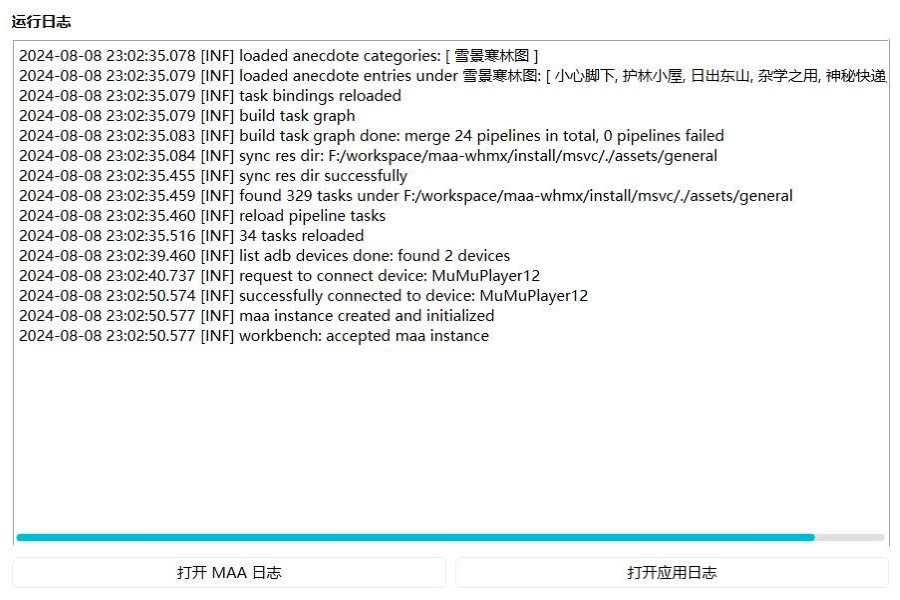
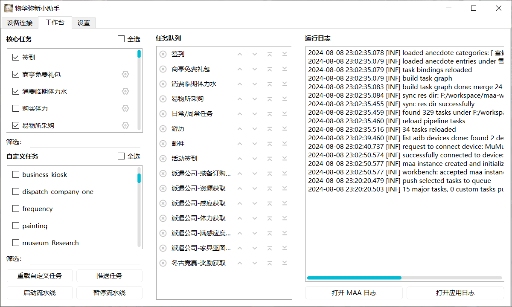
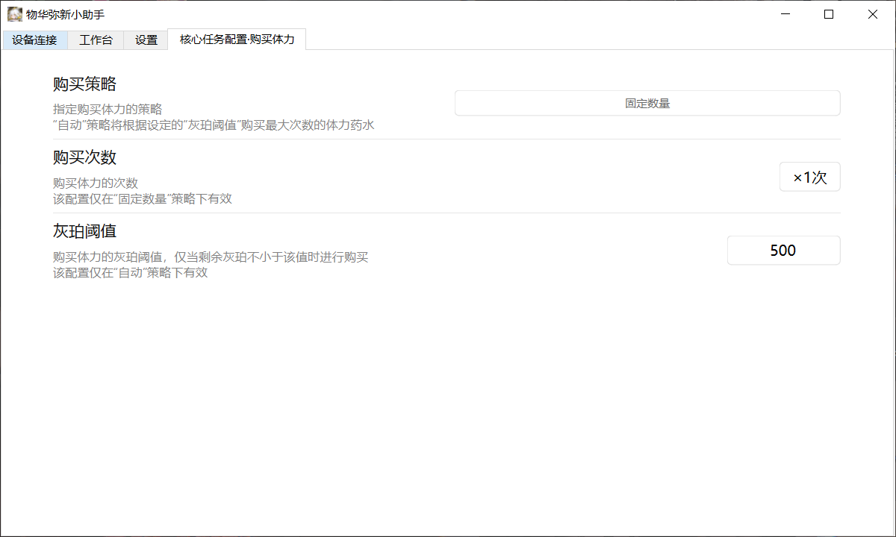
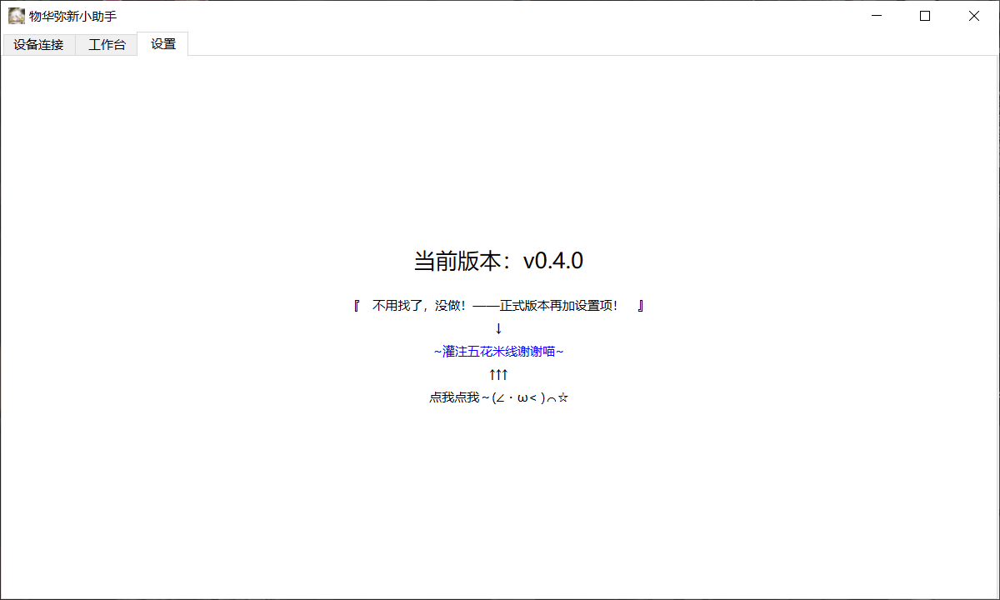

# 快速开始

## 环境要求

- 系统：Windows 10
- 内存：8 GB
- 空闲存储空间：4 GB

## 准备工作

在 [GitHub](https://github.com/MAWHA/maa-whmx/releases) 下载最新的 Release 或 Pre-release，解压至本地目录（推荐英文路径）。

点击 `whmx-assistant.exe` 启动物华弥新小助手。

## 设备连接

> 当前仅支持单设备连接，连接设备后，将无法断开连接或切换设备。
>
> 多设备将在未来版本支持。

在执行任务及其余大多数操作之前，需要连接目标设备。

### **连接步骤**

1. 在设备列表中选择需要连接的设备。
2. 点击“连接”按钮
3. 等待“连接状态”变为“已连接”

> “设备状态”仅指示“设备路径”指示的 adb 可执行文件是否存在。

当设备连接成功后，同时在“工作台”界面的“运行日志”面板中可以看到 `sucessfully connected to device: ...` 的提示。

### **检测设备**

应用在启动后会自动检测活跃的设备，在先启动模拟器的情况下，通常可以检测到至少一个设备。若未找到设备，可以点击“检测设备”进行重新检测，或手动添加本地设备。

### **添加设备**

1. 在第一个输入框手动输入 adb 路径或点击“选择设备”选择本地 adb 可执行文件。
2. 在“设备地址”栏输入目标设备的 adb 通信地址，该地址可通过 adb 命令查询或在模拟器设置中获取。
3. 在“添加为”栏输入该设备在列表中的显示名称，若显示名称冲突，小助手将自动调整名称以区分各设备。

> 若模拟器打开“桥接模式”可能导致 adb 连接失败甚至软件崩溃，请确保连接前关闭该选项。

## 任务添加与执行

任务的添加与执行在“工作台”界面中完成，该界面主要分为“核心任务”、“自定义任务”、“任务队列”与“运行日志”四个板块。

**核心任务** 是目标游戏（此处即为物华弥新）一键长草的全部任务，由 `assets/data/task_bindings.json` 与实际的流水线绑定。

**自定义任务** 为流水线资源中除核心任务之外的根任务入口。

**任务队列** 存放的是当前待执行的任务，构成单独的一条线性流水线。

**运行日志** 显示小助手运行时的日志信息（不包括 MaaFramework 的日志）。

> 关于任务的划分细节请参考[任务划分](任务划分.md)。

### **资源准备**

当本地资源（`assets` 目录下的文件）发生变动时，可点击“重载自定义任务”进行立即重载。

### **任务添加**

在“核心任务”和“自定义任务”中选中需要推送的任务后，点击“推送任务”将任务追加到“任务队列”中。

任务添加后，可以通过“任务队列”中进行任务的删除或次序的调整。

**任务筛选**

“筛选”栏支持按正则表达式对任务列表进行快速筛选，非法的正则表达式将不会触发筛选结果的更新。

当输入为空时，将会显示全部任务。

**全选/取消全选**

可以通过切换“全选”按钮来快速全选/取消全选。

全选/取消全选仅作用于筛选后的任务列表。

**任务配置**

可以对“核心任务”中的可配置任务进行属性配置。

配置变更实时生效并对全局生效。

### **任务执行**

完成任务推送后，点击“启动流水线”，按顺序执行“任务队列”中的任务。

启动后，若任务无效或已经完成（无论是否成功），将会从“任务队列”中移除。

当“任务队列”为空时，流水线将自动终止。

### **任务暂停**

流水线启动后，点击“暂停流水线”，向流水线发出暂停请求，暂停请求完成后流水线将被终止。

暂停流水线不会等待当前正在执行的任务执行结束，而是打断流水线的后继任务。

对于当前正在执行的任务，当该任务执行完毕后不会被移出任务队列。

若要重新启动流水线，请等待当前任务执行完毕，以避免产生不可预料的错误。

## 设置

> 暂未实现

